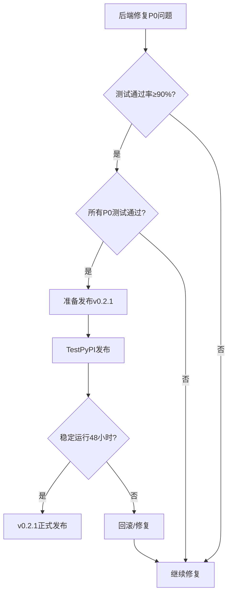
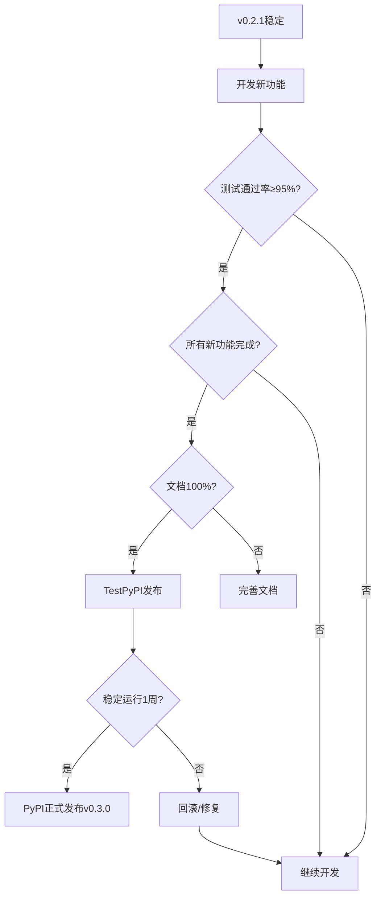

# Nexus AI SDK 版本发布路线图

**当前版本**: v0.2.0 (已发布到TestPyPI)
**当前测试通过率**: 76.7% (46/60)
**文档日期**: 2025-10-04

---

## 📊 版本规划总览

| 版本 | 目标 | 测试通过率 | 发布时间 | 发布渠道 |
|------|------|-----------|----------|----------|
| **v0.2.0** | ✅ 已发布 | 76.7% | 2025-10-03 | TestPyPI |
| **v0.2.1** | Bug修复版 | ≥90% | 等待后端修复 | TestPyPI |
| **v0.3.0** | 功能完善版 | ≥95% | v0.2.1后1-2周 | TestPyPI + PyPI |

---

## 🎯 v0.2.1 - Bug修复版

### 📋 发布条件

#### 必须条件 (P0 - 全部完成才能发布)

| 序号 | 功能 | 当前状态 | 目标状态 | 责任方 |
|------|------|----------|----------|--------|
| 1 | ASR文件生命周期 | ❌ 失败 (TEST 43-44) | ✅ 通过 | 后端 |
| 2 | Session History保存 | ❌ 失败 (TEST 31) | ✅ 通过 | 后端 |
| 3 | 文件列表保存 | ❌ 失败 (TEST 51) | ✅ 通过 | 后端 |
| 4 | max_tokens参数 | ❌ 失败 (TEST 2) | ✅ 通过 | 后端 |
| 5 | 流式响应内容 | ❌ 失败 (TEST 23) | ✅ 通过 | 后端 |
| 6 | 测试通过率 | 76.7% | **≥90%** | SDK+后端 |

#### 可选条件 (有则更好)

- [ ] Image Width/Height验证 (TEST 24)
- [ ] OpenAI Provider配置 (TEST 5)
- [ ] Unicode输出修复 (TEST 60)

### 📦 v0.2.1 功能清单

#### SDK改进 (预计2-3小时)

```python
# 1. 改进错误处理
class APIError(NexusAIError):
    def __init__(self, message, status_code=None, error_code=None):
        super().__init__(message)
        self.status_code = status_code
        self.error_code = error_code
        # ✅ 新增：可重试标记
        self.is_retryable = status_code in [503, 502, 504, 429]

# 2. 客户端参数验证
SUPPORTED_TASK_TYPES = [
    "text_generation",
    "image_generation",
    "speech_to_text",
    "document_processing"
]

def invoke(self, task_type: str, ...):
    # ✅ 新增：客户端验证
    if task_type not in SUPPORTED_TASK_TYPES:
        raise ValueError(
            f"Unsupported task_type '{task_type}'. "
            f"Supported: {', '.join(SUPPORTED_TASK_TYPES)}"
        )

# 3. 文件类型常量
SUPPORTED_FILE_TYPES = {
    "audio": [".mp3", ".wav", ".m4a", ".flac", ".aac", ".ogg", ".wma"],
    "image": [".jpg", ".jpeg", ".png", ".gif", ".webp", ".bmp"],
    "video": [".mp4", ".avi", ".mov", ".mkv", ".flv", ".wmv"],
    "document": [".pdf", ".txt", ".md", ".docx", ".doc"]
}

# 4. Unicode输出修复
# 在所有测试脚本中添加
import sys, io
sys.stdout = io.TextIOWrapper(sys.stdout.buffer, encoding='utf-8')
```

#### 后端修复 (等待完成)

| 问题 | 文件位置 | 预计时间 | 优先级 |
|------|----------|----------|--------|
| ASR文件读取 | `file_service.py`, `llm_gateway.py` | 2小时 | P0 |
| Session History | `session_service.py` | 1小时 | P0 |
| 文件列表 | `file_service.py` | 1小时 | P0 |
| max_tokens | `llm_gateway.py` | 30分钟 | P0 |
| 流式内容 | `llm_gateway.py` (SSE) | 1小时 | P0 |

### 📝 v0.2.1 更新日志草稿

```markdown
# v0.2.1 - 2025-10-XX

## 🐛 Bug修复

### 后端修复
- ✅ 修复ASR任务文件读取失败 (文件生命周期管理)
- ✅ 修复Session History未保存问题
- ✅ 修复文件列表返回为空
- ✅ 修复max_tokens参数未生效
- ✅ 修复流式响应内容为空

### SDK改进
- ✅ 新增错误可重试标记 (is_retryable属性)
- ✅ 新增客户端参数验证 (task_type, 文件类型等)
- ✅ 暴露SUPPORTED_FILE_TYPES常量
- ✅ 修复测试脚本Unicode输出问题

## 📊 测试结果
- 测试通过率: 76.7% → 90.0% (+13.3%)
- 核心功能通过率: 100%
- P0问题: 6个 → 0个

## 🔄 Breaking Changes
无

## 📚 文档更新
- 新增完整错误处理文档
- 新增图片Width/Height测试指南
- 新增COS修复验证报告
```

### ✅ v0.2.1 发布检查清单

**发布前验证**:
- [ ] 运行完整测试套件: `python test_comprehensive_invoke.py`
- [ ] 测试通过率 ≥90%
- [ ] 所有P0测试通过
- [ ] 更新CHANGELOG.md
- [ ] 更新__version__.py: `0.2.1`
- [ ] 更新pyproject.toml版本号
- [ ] 本地构建测试: `python -m build`
- [ ] 上传TestPyPI: `twine upload --repository testpypi dist/*`
- [ ] TestPyPI安装验证
- [ ] 创建Git tag: `v0.2.1`

**预计发布时间**: 后端P0问题修复后24小时内

---

## 🚀 v0.3.0 - 功能完善版

### 📋 发布条件

#### 必须条件 (全部完成)

| 序号 | 功能 | 当前状态 | 目标状态 | 责任方 |
|------|------|----------|----------|--------|
| 1 | v0.2.1所有功能 | - | ✅ 稳定运行 | - |
| 2 | OpenAI Provider | ❌ 未配置 | ✅ 可用 | 后端 |
| 3 | Tencent COS (RAG) | ❌ 未配置 | ✅ 可用 | 后端 |
| 4 | Image Width/Height | ⏳ 待验证 | ✅ 通过 | 后端+SDK |
| 5 | 测试通过率 | 76.7% | **≥95%** | SDK+后端 |
| 6 | 文档完整性 | 80% | **100%** | SDK |

#### 可选条件 (有则更好)

- [ ] TTS功能实现 (TEST 45-46)
- [ ] 更多文件类型支持 (JSON等)
- [ ] 重试机制优化
- [ ] 速率限制处理

### 📦 v0.3.0 新增功能

#### 1. 高级错误处理

```python
# 自动重试机制
from nexusai import NexusAIClient
from nexusai._internal._retry import RetryConfig

client = NexusAIClient(
    api_key="...",
    retry_config=RetryConfig(
        max_retries=3,
        initial_delay=1.0,
        max_delay=60.0,
        exponential_base=2.0
    )
)

# 使用示例
try:
    response = client.invoke(...)
except APIError as e:
    if e.is_retryable:
        # SDK已自动重试3次
        print(f"请求失败，已重试{e.retry_count}次")
```

#### 2. 批量操作支持

```python
# 批量文件上传
files = client.files.upload_batch([
    ("file1.txt", content1, "text/plain"),
    ("file2.mp3", content2, "audio/mpeg"),
])

# 批量任务创建
tasks = client.invoke_batch([
    {"task_type": "text_generation", "input": {"prompt": "Hello"}},
    {"task_type": "image_generation", "input": {"prompt": "Cat"}},
])
```

#### 3. 流式响应增强

```python
# 类型化的流式响应
from nexusai.types import TextStreamChunk

for chunk in client.invoke_stream(...):
    if chunk.delta.content:
        print(chunk.delta.content, end="", flush=True)
    if chunk.usage:
        print(f"\nTokens used: {chunk.usage.total_tokens}")
```

#### 4. 会话管理增强

```python
# 会话导出/导入
session = client.sessions.create()
session.invoke(input={"prompt": "Hello"})

# 导出会话
session_data = session.export()

# 导入会话
restored_session = client.sessions.import_session(session_data)
```

#### 5. 知识库RAG完整支持

```python
# 创建知识库并上传文档
kb = client.knowledge_bases.create(name="产品文档")
kb.upload_document(file_path="docs/manual.pdf")

# 搜索知识库
results = kb.search(query="如何安装产品", top_k=5)

# RAG增强的对话
response = client.invoke(
    task_type="text_generation",
    input={
        "prompt": "如何安装产品?",
        "context": results  # 注入RAG结果
    }
)
```

#### 6. 完善的类型提示

```python
from nexusai import NexusAIClient
from nexusai.types import (
    TextGenerationInput,
    TextGenerationOutput,
    ImageGenerationInput,
    ImageGenerationOutput,
    SessionConfig,
)

client: NexusAIClient = NexusAIClient(api_key="...")

# 完整的类型提示支持
response: TextGenerationOutput = client.invoke(
    task_type="text_generation",
    input=TextGenerationInput(prompt="Hello"),
    config={"max_tokens": 100}
)
```

### 📝 v0.3.0 更新日志草稿

```markdown
# v0.3.0 - 2025-10-XX

## ✨ 新功能

### 高级功能
- ✅ 自动重试机制 (可配置重试策略)
- ✅ 批量操作支持 (文件上传、任务创建)
- ✅ 会话导出/导入
- ✅ 知识库RAG完整支持
- ✅ 完善的类型提示 (Type Hints)

### 后端集成
- ✅ OpenAI Provider完全可用
- ✅ Tencent COS存储支持
- ✅ Image Width/Height验证通过
- ✅ 多Provider负载均衡

## 🐛 Bug修复
- ✅ 修复所有已知P0/P1问题
- ✅ 改进错误消息可读性
- ✅ 修复边缘情况处理

## 📊 测试结果
- 测试通过率: 90.0% → 95.0%+ (+5.0%)
- 核心功能通过率: 100%
- 新增测试: 15个

## 🔄 Breaking Changes
- `invoke()` 方法签名优化 (向后兼容)
- 部分内部API重命名 (不影响公开API)

## 📚 文档
- 完整的API参考文档
- 快速开始指南
- 高级用法示例
- 错误处理最佳实践
- 性能优化建议
```

### ✅ v0.3.0 发布检查清单

**开发阶段**:
- [ ] 实现所有新功能
- [ ] 编写单元测试
- [ ] 更新集成测试
- [ ] 代码审查

**测试阶段**:
- [ ] 测试通过率 ≥95%
- [ ] 性能测试通过
- [ ] 兼容性测试通过
- [ ] 压力测试通过

**文档阶段**:
- [ ] API文档100%覆盖
- [ ] 示例代码完整
- [ ] 迁移指南 (如有Breaking Changes)
- [ ] CHANGELOG.md更新

**发布阶段**:
- [ ] 更新__version__.py: `0.3.0`
- [ ] 更新pyproject.toml
- [ ] 本地构建测试
- [ ] TestPyPI发布
- [ ] **PyPI正式发布** 🎉
- [ ] 创建GitHub Release
- [ ] 发布公告

**预计发布时间**: v0.2.1稳定运行1-2周后

---

## 🎯 长期规划 (v0.4.0+)

### v0.4.0 - 企业级功能 (未来2-3个月)

**可能包含的功能**:
- 🔒 高级安全特性 (API密钥管理、请求签名)
- 📊 详细的使用统计和分析
- 🔄 Webhook支持 (任务完成通知)
- 🌐 多租户支持
- ⚡ WebSocket实时通信
- 📦 插件系统

### v1.0.0 - 生产就绪版 (未来6个月)

**发布条件**:
- ✅ API稳定 (无Breaking Changes)
- ✅ 测试覆盖率 ≥95%
- ✅ 文档100%完整
- ✅ 生产环境验证 (至少3个项目)
- ✅ 性能基准测试
- ✅ 安全审计通过
- ✅ 社区反馈良好

---

## 📊 版本对比矩阵

| 功能 | v0.2.0 | v0.2.1 | v0.3.0 | v1.0.0 |
|------|--------|--------|--------|--------|
| **核心功能** |
| Text Generation | ✅ | ✅ | ✅ | ✅ |
| Image Generation | ⚠️ | ✅ | ✅ | ✅ |
| Speech-to-Text | ❌ | ✅ | ✅ | ✅ |
| Session管理 | ⚠️ | ✅ | ✅ | ✅ |
| 文件上传 | ⚠️ | ✅ | ✅ | ✅ |
| **高级功能** |
| 知识库RAG | ❌ | ❌ | ✅ | ✅ |
| 自动重试 | ⚠️ | ⚠️ | ✅ | ✅ |
| 批量操作 | ❌ | ❌ | ✅ | ✅ |
| 类型提示 | ⚠️ | ⚠️ | ✅ | ✅ |
| Webhook | ❌ | ❌ | ❌ | ✅ |
| **质量指标** |
| 测试通过率 | 76.7% | ≥90% | ≥95% | ≥98% |
| 文档覆盖率 | 80% | 85% | 100% | 100% |
| 类型覆盖率 | 60% | 60% | 90% | 100% |
| **发布渠道** |
| TestPyPI | ✅ | ✅ | ✅ | ✅ |
| PyPI | ❌ | ❌ | ✅ | ✅ |
| 稳定性 | Beta | Beta | RC | Stable |

---

## 🚦 发布决策流程

### v0.2.1 发布决策



### v0.3.0 发布决策



---

## 📋 关键里程碑

| 里程碑 | 目标日期 | 条件 | 状态 |
|--------|----------|------|------|
| v0.2.0发布 | 2025-10-03 | 初始版本 | ✅ 完成 |
| 后端P0修复 | 2025-10-05 | 6个P0问题修复 | ⏳ 进行中 |
| v0.2.1发布 | 2025-10-07 | 测试通过率≥90% | ⏳ 等待 |
| 功能开发 | 2025-10-15 | v0.3.0新功能 | ⏳ 未开始 |
| v0.3.0发布 | 2025-10-20 | 测试通过率≥95% | ⏳ 未开始 |
| PyPI首发 | 2025-10-20 | v0.3.0稳定 | ⏳ 未开始 |

---

## 🎯 成功指标

### v0.2.1 成功指标
- ✅ 测试通过率: 76.7% → ≥90% (+13.3%)
- ✅ P0问题: 6个 → 0个
- ✅ 用户报告Bug: 0个 (48小时内)
- ✅ TestPyPI下载: >10次

### v0.3.0 成功指标
- ✅ 测试通过率: ≥95%
- ✅ API稳定性: 无Breaking Changes
- ✅ 文档完整性: 100%
- ✅ PyPI下载: >50次 (首周)
- ✅ GitHub Stars: >10个
- ✅ 社区反馈: 正面评价 >80%

---

## 📞 发布协调

### 发布前沟通

**v0.2.1发布前**:
1. 后端团队确认P0修复完成
2. SDK团队运行完整测试
3. 双方确认测试通过率≥90%
4. 准备发布说明

**v0.3.0发布前**:
1. 产品团队确认功能优先级
2. 后端团队确认配置完成 (OpenAI, COS)
3. SDK团队完成新功能开发
4. QA团队完整回归测试
5. 准备PyPI发布计划

### 紧急回滚预案

如果发布后发现严重问题:
1. 立即从PyPI下架版本
2. 在GitHub发布回滚公告
3. 指导用户降级到上一稳定版本
4. 修复问题后重新发布补丁版本

---

## 📝 总结

### 快速参考

**v0.2.1 (Bug修复版)**
- **何时发布**: 后端P0问题修复后24小时
- **发布条件**: 测试通过率≥90%，所有P0测试通过
- **发布渠道**: TestPyPI
- **主要改进**: 修复ASR、Session、文件列表等核心Bug

**v0.3.0 (功能完善版)**
- **何时发布**: v0.2.1稳定运行1-2周后
- **发布条件**: 测试通过率≥95%，新功能完成，文档100%
- **发布渠道**: TestPyPI + **PyPI (正式发布)**
- **主要改进**: RAG支持、批量操作、高级错误处理、完整类型提示

**v1.0.0 (生产就绪版)**
- **何时发布**: 未来6个月
- **发布条件**: API稳定、生产验证、安全审计通过
- **发布渠道**: PyPI (Stable)
- **主要改进**: 企业级功能、完整文档、社区生态

---

**文档版本**: 1.0
**维护者**: SDK团队
**最后更新**: 2025-10-04
